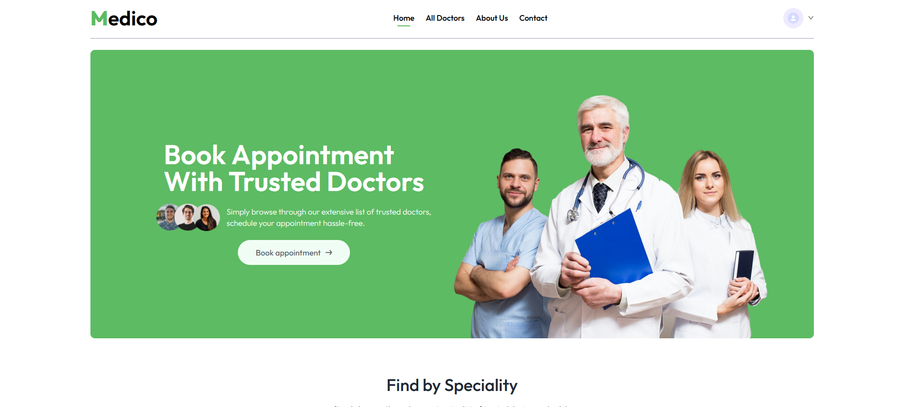

# Full-Stack Hospital Appointment Booking App




## Overview
This is a full-stack application built using the MERN stack (MongoDB, Express, React, Node.js) for booking and managing doctor appointments. The platform offers a seamless user experience with role-based access control, integrated online payments, and comprehensive appointment management functionalities.

## Live Demo
- **Main Portal**: [Medicone Plus](https://medicone-plus.web.app/)
- **Admin/Doctor Panels**: [Medico Panel](https://medicopanal.web.app/)

---

## Key Features

1. **Multi-Role Access**:
   - **Patients**:  
     - Book, view, and manage appointments.  
     - Make payments through an integrated payment gateway.  
   - **Doctors**:  
     - View scheduled appointments.  
     - Manage their profiles and earnings.  
   - **Admin**:  
     - Manage doctor profiles and oversee appointment activities.  
     - Assign roles and approve doctor accounts.  

2. **Online Payment Integration**:
   - A secure payment gateway allows patients to pay for appointments online.  

3. **Dynamic Appointment Management**:
   - Users can book appointments based on doctor availability.  
   - Appointments can be canceled or rescheduled by patients.

4. **User-Friendly Interface**:
   - Intuitive design with tailored experiences for different roles.

5. **Role-Based Access Control**:
   - Access to features and functionalities is restricted based on the user role for security and usability.

6. **Scalable Backend**:
   - MongoDB and Express provide a reliable and scalable backend to handle user data, appointments, and transactions.

7. **Custom Authentication System**:
   - Does not use third-party authentication systems.
   - Uses its own database to create and login, saving user credentials securely.

---

## Tech Stack

1. **Frontend**: React.js
   - Tailored user interfaces for patients, doctors, and admins.
   - Dynamic routing for role-based dashboards.

2. **Backend**: Node.js with Express.js
   - RESTful APIs to handle requests and manage business logic.
   - Middleware for authentication and data validation.

3. **Database**: MongoDB
   - Stores user details, doctor profiles, appointments, and payment records.

4. **Payment Integration**: Stripe
   - Secure and seamless online payment processing.

5. **Authentication**: JSON Web Tokens (JWT)
   - Secure login and session management for all roles.

---

## Setup and Installation

### Clone the Repository
```bash
git clone https://github.com/mehedifiz/Medico-Hospital-Client
 
```

### Install Dependencies
- For the frontend:  
  ```bash
  cd frontend
  npm install
  ```
- For the backend:  
  ```bash
  cd backend
  npm install
  ```

### Set Up Environment Variables
- Create `.env` files for both the frontend and backend.
- Add keys for MongoDB, Stripe, and JWT secrets.

### Run the Project
- Start the backend:  
  ```bash
  cd backend
  nodemon index.js
  ```
- Start the frontend:  
  ```bash
  cd frontend
  npm run dev
  ```

<!-- ### Access the Application
- Open `http://localhost:3000` in your browser. -->

---
 

---

## Credentials

### Patient
```javascript
{
  email: "patient@medico.com",
  password: "patient123"
}
```

<!-- ### Doctor
```javascript
{
  email: "doctor@medico.com",
  password: "doctor123"
}
``` -->

### Admin
```javascript
{
  email: "admin@medico.com",
  password: "admin1"
}
```

---

## Future Enhancements

1. Add multilingual support for global accessibility.  
2. Introduce notifications (email/SMS) for appointment reminders.  
3. Implement data analytics for doctors to analyze earnings and appointment trends.  
 

---

## License
This project is licensed under the MIT License. Feel free to use and modify as needed.
